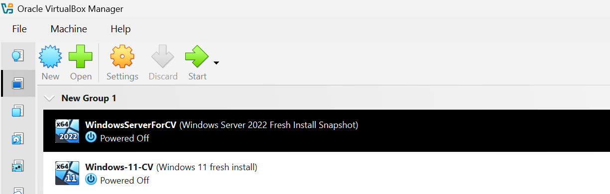
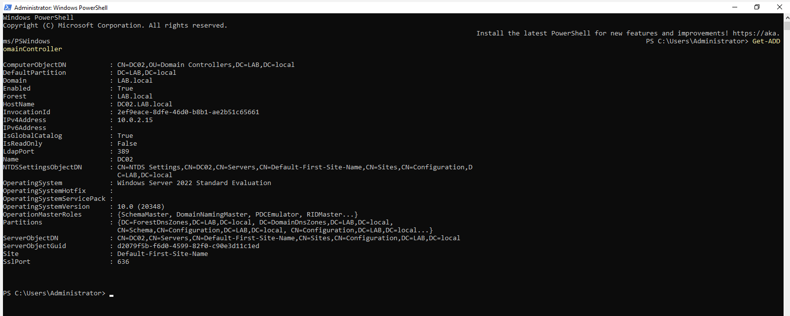
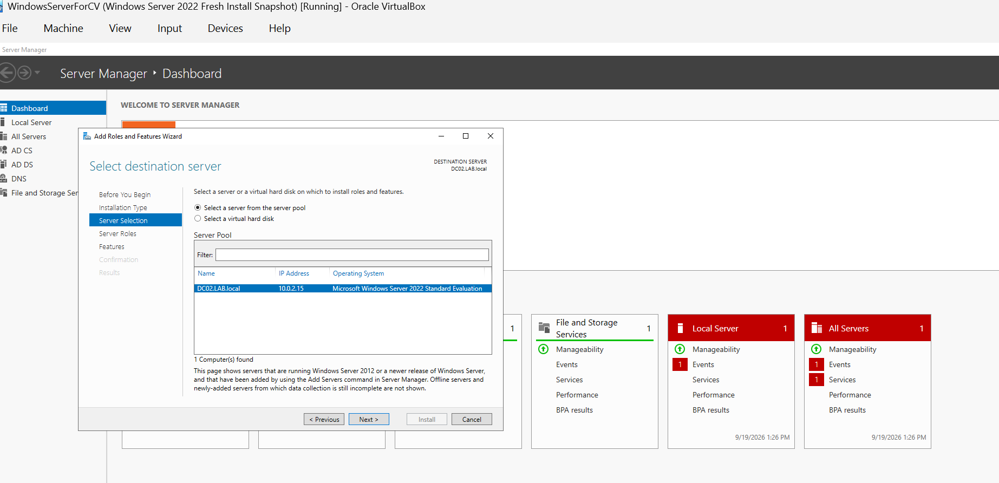
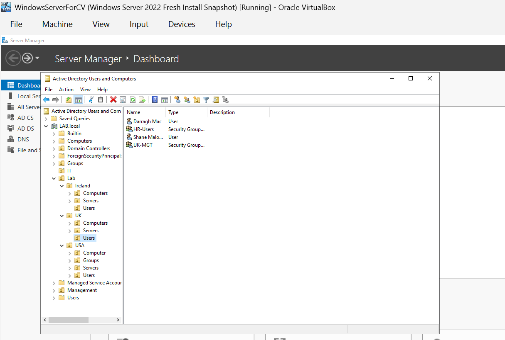
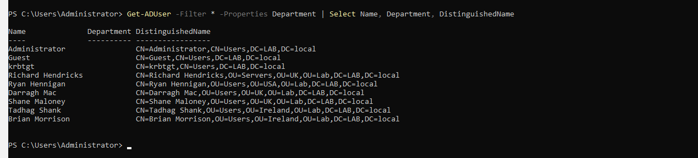
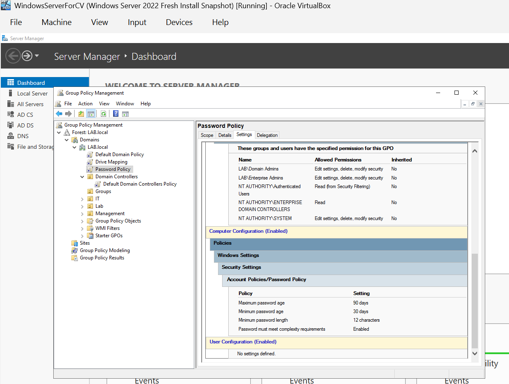
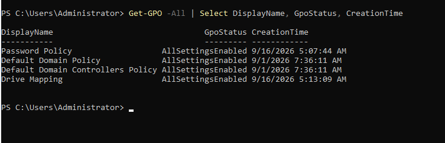
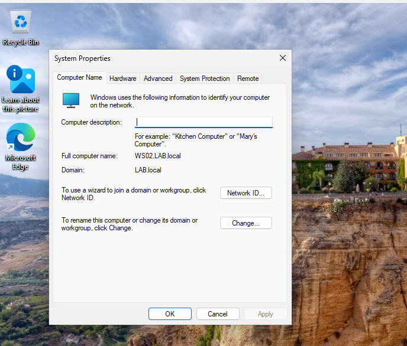

<h1>Active Directory Home Lab</h1>

<h2>Description</h2>
This project builds a small business style Windows Active Directory environment in VirtualBox. A Windows Server machine is configured as a Domain Controller, and a Windows client is joined to the domain. I then created OUs, users and groups, configured Group Policy (including a password policy), and practised common helpdesk tasks such as password resets and troubleshooting the client's connection to the Domain Controller.
 

<h2>Skills Demonstrated</h2>

- Active Directory user, group and OU management
- Group Policy configuration
- Domain accounts: password resets and account unlocks
- Joining a client to a domain
- Basic network and connectivity troubleshooting

<h2>Utilities Used</h2>

- <b>VirtualBox</b>
- <b>Active Directory Domain Services and DNS</b>
- <b>Active Directory Users and Computers</b>
- <b>Group Policy Management</b>

<h2>Environments Used</h2>

- <b>Windows Server</b> (VERSION)
- <b>Windows</b> (VERSION) client

<h2>Lab walk-through:</h2>

<h3>1. Virtual machines set up in VirtualBox:</h3>

  

<h3>2. Server promoted to Domain Controller:</h3>

  

<h3>3. OU structure, users and groups created:</h3>

  

<h3>4. Password policy configured in Group Policy:</h3>

  

<h3>4.1 Group Policy status:</h3>

  

<h3>5.Client joined to the domain:</h3>

  

<h3>6. Logged in as a domain user and policy verified:</h3>

